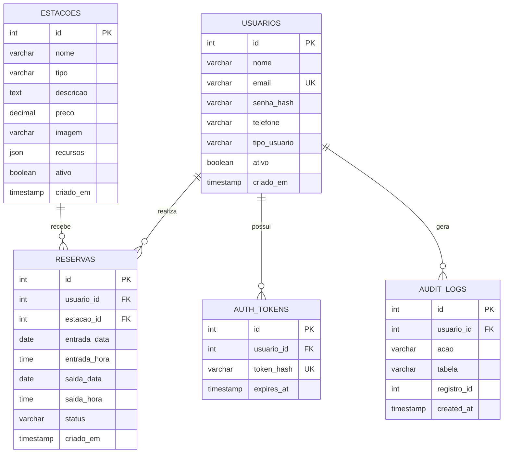

# DER - InkStation

Diagrama entidade-relacionamento inicial do sistema:

## Relacionamentos

- Um usuario pode realizar varias reservas.
- Uma estacao pode receber varias reservas ao longo do tempo.
- Um usuario pode possuir varios tokens de autenticacao.
- Um usuario pode gerar varios registros de auditoria.
